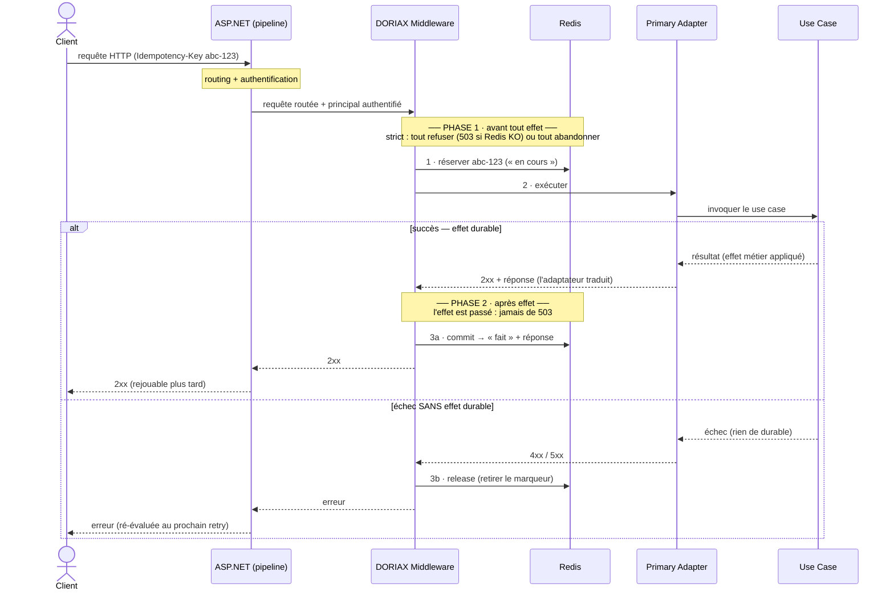
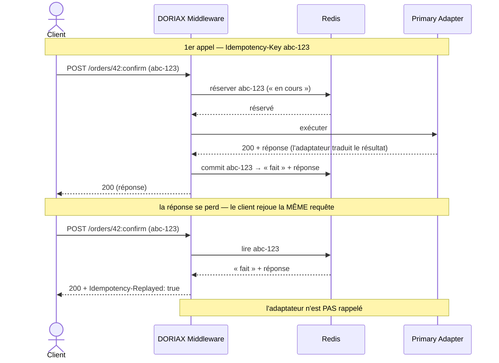
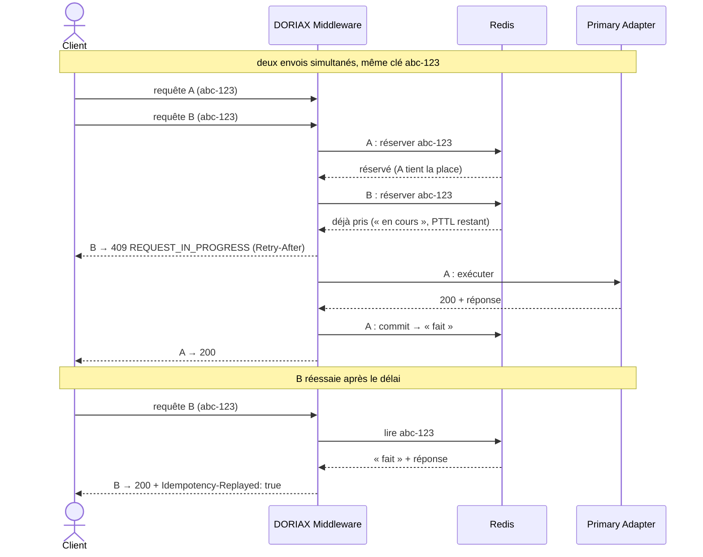
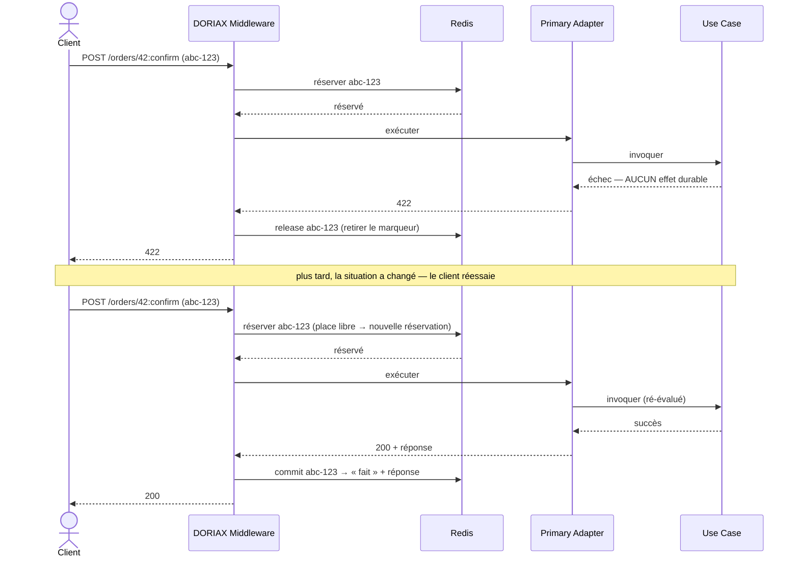
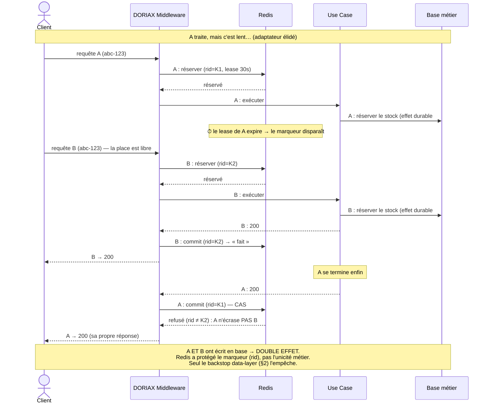
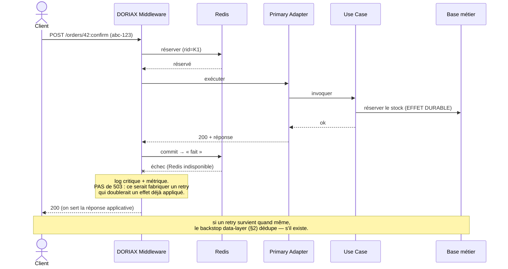

# Idempotence - Implémentation ASP.NET Core

Spécification compagnon de **do-rest** (§3.1, §3.3, §3.4). do-rest pose la règle — `POST` n'est pas idempotent au sens HTTP, l'idempotence d'une commande rejouée est une propriété **du domaine** portée par `Idempotency-Key` — et renvoie ici pour le mécanisme.

> **Nommage.** Les abstractions ci-dessous gardent le préfixe `I` pour rester cohérentes avec le document d'origine. Ce sont des abstractions **d'infrastructure** (le châssis), non des ports de domaine.

---

## Comment lire ce document

Cette spécification suppose **zéro connaissance préalable** de l'idempotence, de Redis, des *leases*, du *CAS* ou des limites de l'« exactly-once ». Chaque terme technique est introduit **par le problème concret qu'il résout**, avec un exemple court. Les encadrés **En clair**, **Exemple**, **Piège évité** et **À ne pas confondre** donnent la version rapide ; les **règles normatives** (en blockquote ou en gras) suivent et font foi. Le contenu technique n'est pas allégé : tous les cas limites sont conservés. Les schémas sont des **diagrammes de séquence** (format Mermaid) : ils s'affichent sur GitHub et la plupart des éditeurs Markdown.

---

## Le problème à résoudre

Un client envoie une commande : `POST /orders/42:confirm` (confirmer la commande 42). Le serveur la traite — réserve le stock, envoie un mail — mais **la réponse se perd** (timeout, réseau coupé, onglet fermé). Le client ne sait pas si ça a marché. Il **renvoie la même requête**.

Sans précaution, le serveur **re-confirme** : stock réservé deux fois, deux mails. C'est le **double effet** qu'on veut éviter.

Pour l'éviter, le serveur doit savoir faire trois choses :
1. **Reconnaître** que cette deuxième requête est le *même* envoi que la première (pas une nouvelle confirmation).
2. **Ne pas relancer** le traitement si le premier a réussi.
3. **Rejouer** la réponse du premier traitement, pour que le client obtienne enfin son résultat.

> **En clair —** L'idempotence, ici, c'est : *deux envois identiques = un seul effet, et la même réponse les deux fois.*

Et un point qui revient **partout** : deux moments très différents dans la vie d'une commande.
- **Avant** que le traitement n'ait produit un effet durable (rien n'a encore changé en base) — on peut se permettre d'être strict, de tout annuler, de refuser.
- **Après** un effet durable (le stock *est* réservé) — on ne peut plus revenir en arrière ; toute la prudence change de nature.

C'est la colonne vertébrale de la spec, posée tout de suite (§0).

---

## 0. Les trois gestes du middleware DORIAX, et les deux phases

Autour de **chaque commande**, le **middleware DORIAX** (le « châssis » ; vocabulaire au §3) fait trois gestes, toujours dans le même ordre. Reprenons l'exemple : `POST /orders/42:confirm`, accompagné de sa **clé d'idempotence** `Idempotency-Key: abc-123` — l'identifiant que le client **réutilise tel quel** quand il rejoue la même commande, pour que le serveur reconnaisse « c'est le même envoi » (détaillé au §4).

**1. La réservation — *avant* de lancer le traitement.**
Le middleware écrit un petit **marqueur** dans Redis (une mémoire partagée par tous les serveurs, rapide ; voir §2) : « la clé `abc-123` est **en cours de traitement** ». C'est comme **poser une réservation sur une place** — tant qu'elle est posée, personne d'autre ne la prend.
*Pourquoi avant l'action ?* Pour deux raisons. **(1)** Si un **doublon** arrive en même temps (double-clic, retry rapide), il trouve la place **déjà prise** et n'exécute pas le traitement en parallèle. **(2)** Ce marqueur est aussi l'**emplacement** où l'on rangera la réponse une fois le travail fini.

Puis le middleware passe la main à l'**adaptateur primaire** (l'endpoint), qui invoque le **use case**. Selon le résultat, **un seul** des deux gestes suivants :

**2a. Le commit *(d'idempotence)* — *après un succès*.**
Le use case a réussi (le stock est réservé) et l'adaptateur a produit la réponse. Le middleware remplace le marqueur par « **fait**, et voici la réponse à renvoyer ». Désormais, tout retour de `abc-123` reçoit cette réponse **sans relancer** le traitement.
> **À ne pas confondre — ce n'est PAS un `COMMIT` SQL.** Aucune transaction de base de données ici. « Commit » veut seulement dire « je **range définitivement** le résultat dans Redis pour pouvoir le **rejouer** ». Le travail métier, lui, a déjà été validé par le use case dans sa propre base.

**2b. Le release — *après un échec qui n'a rien changé*.**
Le use case a échoué **sans rien modifier durablement** (par ex. la commande était déjà annulée). Le middleware **retire le marqueur** et libère la place : un futur retry pourra repartir de zéro.
*Pourquoi retirer, plutôt que mémoriser l'erreur ?* Parce qu'une erreur peut **changer de verdict** plus tard (la commande redevient confirmable). Mémoriser le « non » le figerait à tort ; mieux vaut laisser un retry réévaluer.

> **En une phrase :** réserver la place → exécuter → **ranger le résultat** (commit) *ou* **libérer la place** (release).

**Schéma d'ensemble — les trois gestes, et la coupure avant / après effet :**



**Les deux phases.** Ces gestes se répartissent en deux moments qui n'obéissent pas aux mêmes règles — c'est la colonne vertébrale de toute la spec :

| Phase | Quand | Comment on se comporte |
|---|---|---|
| **Réservation** | **avant** tout effet | strict : on peut **tout refuser** (renvoyer `503` si Redis est indisponible) ou **tout abandonner** — rien n'est encore perdu |
| **Commit / Release** | **après** l'exécution (verdict applicatif rendu) — **commit** si succès (effet durable), **release** si échec **sans** effet durable | prudent : un effet a **peut-être** déjà eu lieu (cas commit) → **jamais de `503`** ; opérations **fencées** et **indépendantes de l'abandon client** |

Les mécanismes précis cités plus loin — `reservationId`, CAS (§12), `fail-closed` (§13) — seront expliqués en temps voulu ; à ce stade, ne retenez que **la coupure avant / après effet**.

Confondre les deux est l'erreur de fond : on ne peut pas appliquer à une écriture *déjà passée* la même rigueur « j'annule tout » qu'à une réservation *où rien ne s'est encore produit*.

---

## 1. Objet et périmètre

**Objectif.** Réduire à **au plus un** effet métier — dans les cas courants de retries, timeouts, doubles soumissions et requêtes concurrentes de même clé — et rejouer à l'identique la réponse d'une commande déjà traitée. **Garantie effective et limites : §2** (le verbe « réduire », et non « garantir », est délibéré).

> **En clair —** On dit « réduire » et pas « garantir » exprès : il reste une fente où le double effet est possible (§2). Promettre l'« exactly-once » serait mentir ; on est honnête sur ce qu'on tient vraiment.

L'idempotence porte sur les **commandes** = `POST` (do-rest n'a que `GET`/`POST`). Hors périmètre : les `GET`, et le `POST` employé comme **transport d'un `GET` à body** (lecture déguisée, do-rest §3.1) — *sûr*, donc **ni clé exigée, ni mémorisation**. La méthode ne suffisant pas à distinguer, le châssis s'appuie sur un marqueur explicite (`[AsQuery]`, §5), `POST` ⇒ commande par défaut.

> **À ne pas confondre —** Un `POST` n'est pas toujours une écriture en DORIAX : il peut servir à transporter une *lecture* qui a besoin d'un corps. Ces lectures déguisées ne reçoivent **pas** d'idempotence (rien à dédupliquer) — d'où le marqueur `[AsQuery]`.

---

## 2. Garanties et limites (à lire en premier)

**Idée générale.** Ce mécanisme **réduit fortement** les doubles effets, mais ne les rend pas **strictement impossibles**. Voici pourquoi, concrètement.

Le châssis note ce qu'il a fait dans **Redis** — une base clé-valeur en mémoire, très rapide, partagée par tous les serveurs. Mais l'effet métier (réserver le stock) se fait dans une **autre** base. Ces deux écritures ne sont pas liées : il existe un court instant où l'une a eu lieu et pas l'autre.

> **Exemple —** Le handler confirme la commande 42 (stock réservé, en base métier), puis le serveur **crashe** juste avant d'écrire dans Redis « c'est fait ». Au retry, Redis ne sait rien → le handler re-confirme → **double effet**. Le filet n'a pas tenu sur cette fente.

```
handler commit la transaction métier → crash avant l'écriture Redis « Completed »
→ au retry, la clé est absente (ou son lease a expiré) → le handler ré-exécute → double effet
```

**Vocabulaire.** Ce qu'on garantit s'appelle **at-most-once best-effort + rejeu** : « au plus une fois, au mieux » — on évite le doublon dans les cas courants (retry réseau, double-clic, requêtes simultanées) et on rejoue la réponse ; on ne promet **pas** l'« exactly-once » (exactement une fois, garanti quoi qu'il arrive).

- **Garanti** : déduplication des cas courants, rejeu fidèle, détection de réutilisation de clé.
- **Non garanti seul** : l'exactly-once strict.

> **Le `reservationId` (§6, §12) ne change pas ce verdict.** Il protège l'**intégrité de l'enregistrement** (un handler dont le lease a expiré ne peut pas écraser le record d'un autre), **pas l'unicité d'exécution** : si A déborde son lease et que B ré-exécute, les deux effets se produisent. Seul le **backstop data-layer** rattrape ce cas.

> **À ne pas confondre —** « protéger le marqueur dans Redis » ≠ « garantir une seule exécution ». Le premier empêche d'écraser une donnée ; le second empêche un effet métier en double. Ce sont deux problèmes distincts (détail au §12).

**Le filet de sécurité « data-layer » (backstop).** Pour les opérations qu'on ne peut pas se permettre de jouer deux fois (mouvements de stock, argent), on ferme la fente : on écrit la clé d'idempotence **dans la même base et la même transaction** que l'effet métier. Si un retry tente de rejouer, la base le refuse (clé déjà présente).

> **En clair —** Redis sert à aller vite et à rejouer. Pour le **sensible**, c'est la **base métier elle-même** qui garantit « une seule fois », via une contrainte d'unicité — pas Redis.

> **Piège évité —** Croire que Redis « suffit ». Redis accélère et déduplique le cas courant ; la garantie *dure* pour le sensible vient de la transaction métier. Pour ces opérations, le backstop est **obligatoire**, pas optionnel.

```sql
CREATE TABLE processed_commands (
    idempotency_key  varchar(255) PRIMARY KEY,
    command          varchar(128) NOT NULL,
    occurred_at      timestamptz  NOT NULL DEFAULT now()
);
-- INSERT dans la MÊME transaction que la mutation ; violation d'unicité ⇒ doublon ⇒ on n'applique pas l'effet
```

---

## 3. Insertion dans le pipeline ASP.NET et couches

**Idée générale.** Le client ne parle pas à un « châssis » abstrait : sa requête HTTP entre d'abord dans **ASP.NET** (le pipeline : routing, authentification…). Le code d'idempotence est **un middleware** de ce pipeline — le **`DORIAX Middleware`** des schémas — placé **après** le routing et l'authentification. Il enveloppe la suite : il intercepte la requête avant, la réponse après.

> **Vocabulaire (clean architecture) — utilisé dans tous les schémas :**
> - **ASP.NET (pipeline)** : la porte d'entrée HTTP ; fait routing + auth, puis passe la main.
> - **DORIAX Middleware** : *ce qu'on appelle « le châssis »*. C'est lui qui réserve, capture, commit/release, rejoue. Le client ne l'atteint qu'**à travers** ASP.NET.
> - **Primary Adapter** : l'endpoint (controller / minimal API). Il traduit HTTP ↔ domaine : désérialise, **appelle le use case**, puis **transforme le résultat en `2xx` + corps**.
> - **Use Case** : la logique applicative. C'est lui qui **produit l'effet métier durable** (et le verdict succès/échec) — *pas* l'adaptateur.
> - **Base métier** : le stockage de l'effet durable (≠ Redis).
>
> Dans la prose, « le châssis » = le DORIAX Middleware ; « exécuter le handler » = l'adaptateur appelle le use case.

Le middleware est placé **après `UseRouting`** (pour lire les métadonnées d'endpoint — les attributs `[AsQuery]`…, sinon il ne les voit pas) et **après l'authentification** (la clé est isolée par appelant, §11) ; il capture la réponse applicative **avant** la compression de transport.

```
Client → ASP.NET : UseRouting → UseAuthentication → UseAuthorization
       → DORIAX Middleware (réserve → exécute → commit / release)
       → Primary Adapter → Use Case → (Base métier)
```

> **Lecture des schémas —** le schéma d'ensemble (§0) montre **toute** la chaîne. Les schémas de cas qui suivent **zooment** : ils ne gardent que les acteurs porteurs de la leçon (le pipeline ASP.NET, et selon le cas l'adaptateur ou le use case, sont **élidés** quand ils n'apportent rien).

---

## 4. Contrat HTTP

**Idée générale — l'`Idempotency-Key`.** Le client place dans chaque commande un en-tête **`Idempotency-Key`** : un identifiant **qu'il choisit** et **réutilise tel quel** quand il rejoue la même commande. C'est ainsi que le serveur reconnaît « c'est le même envoi », et non une commande neuve.

> **Exemple —** `POST /orders/42:confirm` avec `Idempotency-Key: abc-123`. Si la réponse se perd, le client renvoie **exactement** la même requête avec **le même** `abc-123`. Une *nouvelle* confirmation, elle, utiliserait une *nouvelle* clé.

| Situation | HTTP | `code` |
|---|---|---|
| Clé manquante sur une commande `POST` | `428` | `IDEMPOTENCY_KEY_REQUIRED` |
| Clé invalide (grammaire) | `400` | `IDEMPOTENCY_KEY_INVALID` |
| Même clé, **empreinte différente** | `409` | `IDEMPOTENCY_KEY_REUSED` |
| Même clé, même empreinte, **en cours** | `409` (+ `Retry-After`) | `IDEMPOTENCY_REQUEST_IN_PROGRESS` |
| Store indisponible (phase réservation, FailClosed) | `503` (+ `Retry-After`) | `IDEMPOTENCY_STORE_UNAVAILABLE` |
| Rejeu d'une réponse mémorisée | statut d'origine | en-tête `Idempotency-Replayed: true` |

- **`Retry-After` du `REQUEST_IN_PROGRESS`** : dérivé du **TTL restant** du `Processing` (le script Lua retourne le `PTTL`), arrondi au supérieur. Si `PTTL <= 0` (`-2` = clé absente, `-1` = sans expiration — ne devrait pas survenir sur un `Processing`), repli `1` **+ log « incohérence store »**. Pas une constante.
- **Grammaire de la clé** : type token `[A-Za-z0-9._:-]{1,255}` (plus strict qu'« ASCII imprimable » : pas d'espaces ni de caractères pénibles en logs). UUID v4 / ULID recommandés.
- **Hors périmètre** (`GET` ou `[AsQuery]`) : un éventuel `Idempotency-Key` est **ignoré** par le châssis (ni validé, ni refusé) — inoffensif sur une lecture.
- Charges d'erreur au format DORIAX (do-rest §3.3 ; à terme HDL / RFC 9457).

> **À ne pas confondre —** `428` = « tu **dois** fournir une clé » (elle manque). `409 KEY_REUSED` = « tu as réutilisé une clé pour **autre chose** ». `409 REQUEST_IN_PROGRESS` = « la **même** commande est **déjà en cours**, réessaie ».

---

## 5. Marqueurs (attributs) — dire au châssis comment traiter une action

**Idée générale.** Par défaut, le châssis applique sa logique d'idempotence à **toute commande `POST`** (§1), avec une empreinte calculée automatiquement (§7) et une réponse rejouée en projection minimale (§9.1). Trois attributs permettent de **déroger** à ces défauts, action par action. Aucun n'est obligatoire ; on ne les pose que pour sortir du comportement standard.

> Tous : `[AttributeUsage(AttributeTargets.Class | AttributeTargets.Method, Inherited = true)]` — posables sur la **classe** (vaut pour toutes ses actions) ou la **méthode**, et hérités. En Minimal API, chacun a une extension fluide équivalente.

---

### `[AsQuery]` — « ce `POST` est une lecture, pas une commande »

**D'où ça vient.** DORIAX n'a que deux verbes (`GET`/`POST`). Mais un `POST` n'est pas toujours une écriture : quand une *lecture* a besoin d'un corps (recherche complexe qui ne tient pas dans la query string), do-rest §3.1 autorise un `POST` qui reste **sûr** — une « lecture déguisée ». Le périmètre par défaut « `POST` = commande » englobe alors à tort ces lectures.

**À quoi ça sert.** Déclarer qu'une telle action est une requête : le châssis la considère **hors périmètre** — pas de clé exigée, pas de réservation, pas de mémorisation (exactement comme un `GET`). C'est le **seul** attribut qui *retire* une action de l'idempotence.

```csharp
public sealed class AsQueryAttribute : Attribute { }

[HttpPost("/reports:search"), AsQuery]               // recherche : lecture à corps, pas une commande
public Task<IResult> Search([FromBody] ReportQuery q) { … }

app.MapPost("/reports:search", Search).AsQuery();    // Minimal API
```

> **À ne pas confondre —** `[AsQuery]` ne « désactive » pas l'idempotence par confort : il **déclare une nature** (cette opération est une lecture). À réserver à un `POST` réellement **sûr** (aucun effet de bord). Le poser sur une vraie commande supprimerait sa protection contre les doublons.

---

### `[IdempotencyFingerprint(typeof(MonBuilder))]` — « calcule l'empreinte autrement »

**D'où ça vient.** Pour reconnaître deux requêtes « identiques », le châssis calcule par défaut une empreinte sur méthode + route + query + corps (§7). Ce défaut est parfois inadapté : un champ **volatil** dans le corps (timestamp client, n° de tentative) ferait croire à tort que deux retries sont *différents* → faux `409 KEY_REUSED` ; ou bien seuls quelques champs portent réellement l'intention.

**À quoi ça sert.** Fournir un calculateur sur mesure (`IIdempotencyFingerprintBuilder`, §7) qui **remplace entièrement** le calcul par défaut pour cette action. Il doit produire une chaîne **stable** pour une même intention.

```csharp
public sealed class IdempotencyFingerprintAttribute(Type builderType) : Attribute
{
    public Type BuilderType { get; } = builderType;
}

[HttpPost("/transfers:execute"),
 IdempotencyFingerprint(typeof(TransferFingerprintBuilder))]    // ignore l'horodatage client, ne hash que (compte, montant)
public Task<IResult> Execute([FromBody] TransferRequest r) { … }
```

> **Important —** cet attribut **n'active ni ne désactive** l'idempotence, et il est **ignoré sur une requête** (`GET` / `[AsQuery]`) : il ne fait que **substituer le calculateur d'empreinte**.

---

### `[IdempotencyReplaysBody]` — « le corps EST le résultat, rejoue-le à l'identique »

**D'où ça vient.** do-rest §3.4 : la plupart des commandes renvoient juste « c'est fait + un lien », et le client peut **relire** l'objet par un `GET`. Mais quelques-unes renvoient un résultat qu'**aucune relecture ne peut redonner** — un secret ou un token affiché **une seule fois**.

**À quoi ça sert.** Dire au châssis de **mémoriser et rejouer le corps verbatim** (au lieu de la projection minimale, §9.1), parce qu'il n'est pas reconstructible. Active les **règles dures** du §9.2 : rétention courte dédiée, chiffrement du corps, zéro log, et **aucune dégradation** (hard-fail si le corps dépasse le cap, plutôt que rejouer un minimal trompeur).

```csharp
public sealed class IdempotencyReplaysBodyAttribute : Attribute { }

[HttpPost("/api-keys:create"), IdempotencyReplaysBody]   // renvoie la clé en clair, une seule fois
public Task<IResult> CreateKey(...) { … }

app.MapPost("/api-keys:create", CreateKey).ReplaysIdempotencyBody();   // Minimal API
```

> **Piège évité —** sans cet attribut, un retry sur un secret perdu rejouerait une réponse *minimale* → le secret serait perdu **silencieusement** (le client croirait à un rejeu normal, §9.2).

---

**Extensions Minimal API** (sucre sur `WithMetadata`) :

```csharp
public static RouteHandlerBuilder AsQuery(this RouteHandlerBuilder b)
    => b.WithMetadata(new AsQueryAttribute());
public static RouteHandlerBuilder ReplaysIdempotencyBody(this RouteHandlerBuilder b)
    => b.WithMetadata(new IdempotencyReplaysBodyAttribute());
```

> **Pourquoi `[AsQuery]` n'a pas le préfixe `Idempotency`, et les deux autres si ?** Ce n'est pas une négligence : `[AsQuery]` exprime une décision **DORIAX** — *cette opération est-elle une commande ou une requête ?* — qui dépasse l'idempotence (d'où le nom court, aligné sur l'extension `.AsQuery()`). `[IdempotencyFingerprint]` et `[IdempotencyReplaysBody]`, eux, ne concernent **que** le châssis d'idempotence — d'où le préfixe. Le nom dit à quelle couche appartient la décision.

---

## 6. Machine à états : réserver, exécuter, mémoriser

**Idée générale.** Pour empêcher deux traitements simultanés *et* pouvoir rejouer plus tard, le châssis pose un **petit marqueur** sur la clé **avant** de lancer le handler, puis le complète **après**.

> **Exemple —** Première requête `POST /orders/42:confirm`, `Idempotency-Key: abc-123` :
> 1. le middleware pose un marqueur « **en cours** » sur `abc-123` ;
> 2. il fait exécuter le traitement (adaptateur → use case) ;
> 3. succès → il remplace le marqueur par « **fait** » + la réponse.
> Une requête `abc-123` qui arrive **pendant** l'étape 2 voit « en cours » → on ne relance pas. Une qui arrive **après** voit « fait » → on rejoue la réponse sans relancer.

**Schéma — 1er appel réussi, puis rejeu :**



**Schéma — doublon concurrent (`REQUEST_IN_PROGRESS`) :**



**Vocabulaire — les états du marqueur.** Une **seule clé Redis** porte l'enregistrement, sur une machine à états :

- **réservation** : poser le marqueur **avant** l'action. *Pourquoi avant ?* Pour qu'un doublon simultané trouve la place **déjà prise**, au lieu que les deux s'exécutent en parallèle.
- *(absent)* → requête nouvelle.
- **`Processing`** (« en cours ») → une commande identique est **déjà en traitement**. Sert à répondre « reviens plus tard » à un doublon, sans relancer. Durée de vie = **lease**.
- **`Completed`** (« fait ») → le traitement a réussi, la **réponse est mémorisée**. Sert à **rejouer** cette réponse sans relancer le handler. Durée de vie = **rétention**.
- **lease** → une durée de vie posée sur le marqueur « en cours ». *Pourquoi ?* Si le serveur qui traitait **crashe**, son marqueur « en cours » resterait coincé pour toujours et bloquerait tous les retries. Le lease le fait **expirer automatiquement** pour qu'un retry puisse reprendre (détail au §12).

Pas d'état `Failed` persistant : un échec rejouable **libère** la réservation (voir *release* ci-dessous). Point de linéarisation : la **réservation atomique** (`SET NX` / Lua), qui élimine la course *check-then-set* et règle la concurrence **sans verrou distribué**.

```text
fp  = ComputeFingerprint(request)
key = "doriax:idem:" + scope(tenant, principal) + ":" + sha256(idempotencyKey)

(reserved, rid, existing, remainingLease) = ReserveOrRead(key, fp, lease)   // atomique (Lua)

if reserved:                                            // PHASE 2 ci-dessous
    try: await handler()
    catch: Release(key, rid, internalToken); rethrow    // échec → libère (fencé)
    if status in 2xx:  Commit(key, rid, record…, internalToken)   // fencé, tolérant
    else:              Release(key, rid, internalToken)           // non-2xx ⇒ pas d'effet (contrat §8)
else:
    if existing.fp != fp:           409 KEY_REUSED
    elif existing.Processing:       409 REQUEST_IN_PROGRESS (Retry-After: ceil(remainingLease) ?? 1)
    else:                           Replay(existing)              (+ Idempotency-Replayed: true)
```

> **En clair — les deux verbes du pseudo-code :**
> - **commit (d'idempotence)** = enregistrer dans Redis « fait + cette réponse », après un succès. **Ce n'est PAS un commit SQL** : aucune transaction base, juste « je mémorise le résultat pour pouvoir le rejouer ».
> - **release** = supprimer la réservation, après un échec **qui n'a rien changé durablement**, pour qu'un retry reparte proprement (sinon le marqueur « en cours » bloquerait jusqu'à expiration du lease).

**Commit / Release sont conditionnels** (n'agissent que si la clé est **encore détenue par ce `rid`**, et **commit comme release** seulement **depuis l'état `Processing`**, §12). Ainsi un handler A dont le lease a expiré, repris par B, **ne peut plus** écraser ni supprimer l'état de B : son `Commit`/`Release` échoue silencieusement, A rend sa réponse à son appelant, et le backstop dédupe (s'il existe).

> **Ownership perdu : la réponse servie peut ≠ celle mémorisée.** A ayant déjà produit sa réponse *avant* de tenter le commit, on ne peut pas la « rappeler » — l'écart est donc **inévitable**, pas seulement toléré, et le record Redis ne doit plus être touché par l'ancien détenteur. Sans conséquence observable : A est dans le cas standard du **doublon** et, en retentant, tombera sur le rejeu de B.

---

## 7. L'empreinte : reconnaître « la même requête »

**Idée générale.** La clé `abc-123` dit « c'est un retour du même envoi ». Mais que se passe-t-il si un client **réutilise** `abc-123` pour une requête **différente** (par erreur, ou malveillance) ? Le châssis doit le détecter. Pour ça, il calcule une **empreinte** de la requête : un résumé de son contenu.

> **Exemple —** `abc-123` sert d'abord pour `POST /orders/42:confirm`. Plus tard, `abc-123` revient sur `POST /orders/99:confirm`. Même clé, **contenu différent** → empreintes différentes → le châssis refuse (`409 KEY_REUSED`) au lieu de rejouer la mauvaise réponse.

> **À ne pas confondre —** la **clé** (`Idempotency-Key`) est choisie par le **client** pour dire « c'est le même envoi » ; l'**empreinte** est calculée par le **serveur** pour vérifier que le contenu est bien le même. La clé identifie, l'empreinte contrôle.

```csharp
public interface IIdempotencyFingerprintBuilder
{
    ValueTask<string> BuildAsync(HttpContext context, CancellationToken cancellationToken);
}
```

**Vocabulaire.** L'**empreinte (fingerprint)** est un *hachage* (résumé de taille fixe, ici SHA-256) du contenu de la requête. Deux requêtes identiques → même empreinte ; deux différentes → empreintes différentes.

**Mode par défaut.** SHA-256 sur, dans cet ordre et avec **séparateurs non ambigus** (segments préfixés de leur longueur) : méthode · *template* de route · valeurs de route triées · query normalisée · empreinte du corps. **Exclusions strictes** : `Date`, `traceparent`, corrélation, valeur d'`Authorization` (le principal est dans la portée de la clé).

> **Corps : défaut = octets bruts ; JCS seulement là où c'est testé.** L'asymétrie des échecs commande ce choix. Le hash d'**octets bruts** échoue **safe** : deux sérialisations du même JSON donnent un faux `409 KEY_REUSED` que le client gère. Un bug de canonicalisation JCS/RFC 8785 (nombres, encodages, `null`, tableaux, JSON invalide, `application/*+json`) échoue **dangereux** : deux requêtes *différentes* normalisées pareil ⇒ rejeu silencieux de la mauvaise réponse. On n'active JCS que sur une bibliothèque éprouvée et des content-types maîtrisés ; sinon octets bruts.

> **Query à paramètres répétés.** `?tag=a&tag=b` ≠ `?tag=b&tag=a` par défaut : on **préserve l'ordre des valeurs répétées** (faux `409` plutôt que faux rejeu). Si l'ordre n'est pas sémantique pour une action, fournir un builder spécifique qui normalise.

> **Stabilité de l'empreinte sur le parc (contrainte de déploiement).** L'empreinte est le test d'égalité « même requête » : son calcul doit être **identique sur tous les nœuds et entre versions**. Une dérive — typiquement la lib de canonicalisation qui change pendant un déploiement *rolling* — fait qu'un retry réservé sur node-1 puis rejoué sur node-2 calcule une empreinte **différente** ⇒ faux `409 KEY_REUSED` sur toutes les clés en vol pendant la bascule. Tout changement de l'algorithme est donc **breaking** pour l'idempotence en cours : le **versionner** (tag d'algo dans le record, traitement indulgent des versions divergentes). Raison de plus de préférer les **octets bruts** par défaut (moins de surface de dérive que JCS). **Invariant de stabilité, partagé avec l'encodage de la clé hashée (§11) : deux nœuds doivent calculer *bit pour bit* la même empreinte ET la même clé — c'est le même piège.**

**Mode personnalisé.** `[IdempotencyFingerprint(typeof(...))]` remplace **entièrement** le défaut ; le calculateur doit produire une chaîne **stable** pour une même intention.

---

## 8. Politique de mémorisation des réponses

**Idée générale.** On ne mémorise (pour rejouer) que les réponses correspondant à un **effet réussi**. Une erreur, elle, ne se mémorise pas : on **efface la réservation** pour qu'un retry puisse réessayer.

> **Exemple —** `confirm` échoue parce que la commande est déjà annulée (`422`). Rien n'a été modifié. On efface la réservation. Si le client réessaie après avoir réglé le problème, le serveur réévalue — il ne lui ressert pas une vieille erreur figée.

**Schéma — échec sans effet → `release`, puis ré-évaluation au retry :**



> **On ne mémorise que les `2xx`.** Tout le reste (`3xx`/`4xx`/`5xx`) **libère la réservation** et sera **ré-évalué** au retry.

Justifié par do-rest §3.3 : `409` (conflit d'état) et `422` (règle métier) sont **dépendants de l'état** — les figer bloquerait un retry légitime ; `401`/`403`/`408`/`425`/`429`/`5xx` sont transitoires.

> **Précondition de handler (et non simple convention).** *Toute réponse non-2xx d'une commande doit être produite **avant** mutation durable, ou **après** rollback. Une commande ayant produit un effet durable doit répondre en **2xx**, même si l'état résultant est partiel ou asynchrone.* Sans cette précondition, l'hypothèse « non-2xx ⇒ pas d'effet ⇒ release » est fausse et le retry double l'effet. Un use case qui ne peut pas la tenir (effet partiel non transactionnel) doit soit aboutir à un 2xx, soit porter le backstop (§2).

> **Piège évité —** Mémoriser une erreur. Comme une erreur peut **changer de verdict** plus tard (la commande devient confirmable), la rejouer figerait un « non » qui n'est plus vrai. D'où : seuls les **succès** sont mémorisés.

`202 Accepted` étant un `2xx`, on mémorise l'**acceptation** (statut + lien de suivi) → un retry rejoue l'acceptation **tant que le `Completed` a été écrit**. La fenêtre résiduelle du §2 s'applique ici à l'**enqueue** : enqueue réussi → crash avant `Completed` → le retry peut ré-enfiler. Donc **pour les commandes asynchrones sensibles, l'identifiant d'idempotence doit aussi être porté par le système de jobs / l'outbox** (clé de job unique, contrainte d'unicité) afin d'éviter le double *enqueue* dans cette fenêtre. Les `409` produits **par le châssis** ne sont jamais mémorisés (méta-réponses).

---

## 9. Capture, persistance et rejeu

**Idée générale.** Pour pouvoir rejouer, le châssis doit **lire le corps de la requête** (pour l'empreinte) et **capturer la réponse** du handler avant de la renvoyer. Les deux se font en mémoire, avec des plafonds de taille.

**Requête** : `EnableBuffering()` (permet de relire le corps), taille plafonnée, flux rembobiné.

**Réponse** : capturée par substitution de flux, plafond configurable. En-têtes mémorisés : **liste blanche** (`Location`, `ETag`, `Content-Type`, `Preference-Applied`). **Jamais** `Set-Cookie`, `Date`, `traceparent`, `WWW-Authenticate`, en-têtes hop-by-hop, et explicitement **jamais `Content-Length` ni `Transfer-Encoding`** — recalculés au rejeu (un `Content-Length` mémorisé devient faux dès qu'on reconstruit un body minimal). Tout rejeu ajoute `Idempotency-Replayed: true`.

### 9.1 Projection minimale par défaut, *verbatim* en exception

**Idée générale.** En DORIAX, la réponse d'une commande se résume à « c'est fait + voici le lien » (CQS, do-rest §3.4) : le client peut toujours **relire** l'objet avec un `GET`. Donc on ne mémorise **pas** la représentation complète — juste de quoi confirmer et retrouver l'objet.

- **Défaut** : on **ne mémorise pas la représentation**. Même si le 1er appel demande `Prefer: return=representation` (servie en direct), le store ne retient que la **projection minimale**. La représentation ne touche jamais Redis.
- **Rejeu toujours minimal** : statut + en-têtes liste blanche + HDL minimal reconstruit + `Idempotency-Replayed: true` + `Preference-Applied: return=minimal` + `Content-Type` **forcé** au média HDL. Légal (`Prefer` est une préférence, RFC 7240). Le client suit `self` pour l'entité à jour.
- **Exception `[IdempotencyReplaysBody]`** : secret/token affiché une seule fois, non reconstructible. Le corps **est** l'issue → mémorisé et rejoué **verbatim**.

**Reconstruction du HDL minimal — règle par statut** (le `self` d'une action ≠ sa route : `POST /orders/42:confirm` n'est **pas** `/orders/42`, donc **pas** de dérivation du self par *suffix-stripping*) :

| Statut | `self` au rejeu | Body minimal |
|---|---|---|
| `201` | `Location` (requis) | `{ "_links": { "self": { "href": Location } } }` |
| `202` | lien de suivi requis (`Location` ou `_links.status` capturé) | le lien de suivi |
| `204` | — | **aucun** |
| `200` | fourni par le handler (`Content-Location` ou `_links.self` capturé sous minimal) | si absent → statut + en-têtes, **pas** de body synthétisé |

### 9.2 Mode *verbatim* — quand le corps **est** le résultat

**Idée générale.** D'habitude la réponse est reconstructible par un `GET`. Mais certaines réponses contiennent quelque chose qu'**aucune relecture ne peut redonner**.

> **Exemple —** `POST /api-keys:create` renvoie une clé d'API **en clair, une seule fois** ; ensuite le serveur n'en garde qu'une empreinte. Si le client perd cette réponse, **personne** ne peut la lui redonner.

**Vocabulaire.** Le **mode verbatim** (de *verbatim* = mot pour mot) : pour ces réponses, le châssis mémorise et rejoue le **corps exact**, à l'identique — pas la projection minimale.

**Règles dures (sécurité + intégrité).** Pour `[IdempotencyReplaysBody]`, on stocke un secret en clair pendant la rétention : rétention **courte** propre à ce mode (`ReplaysBodyRetention`, distincte des 24 h), **chiffrement applicatif** du body, Redis dédié, accès restreint, **zéro log** du body.

> **Le dépassement de plafond n'est PAS une dégradation possible.** En mode par défaut, un corps trop grand dégrade en « on ne mémorise pas → ré-exécution au retry », ce qui est **sûr** car le résultat est reconstructible. En mode *verbatim*, le résultat est **non reconstructible** : dégrader en minimal ferait perdre le secret **silencieusement** (le client croit à un rejeu normal). Verbatim n'a donc **aucune dégradation sûre** : soit on mémorise verbatim, soit on **échoue durement** (`500`).
>
> **Mais le `500` ne *sauve* rien.** L'effet a pu déjà avoir lieu, le secret peut être **définitivement perdu** pour le client, et le retry ne le récupérera pas. Le hard-fail n'évite que le *mensonge protocolaire* (rejouer un minimal à la place) — il ne **répare pas** l'incident. Conséquences à graver :
> - le plafond `MaxReplayBodyBytes` est **validé avant la mise en production** (tests contractuels / validation de configuration), pas découvert en runtime ;
> - le hard-fail est un **dernier garde-fou non exploitable**, pas un comportement normal ;
> - ces endpoints **doivent** disposer d'une **stratégie de récupération** métier/support (sans quoi on crée une ressource dont le secret n'a jamais été remis) **et** du backstop ;
> - le hard-fail **réinitialise toute la réponse** — statut, **en-têtes** et corps — pas seulement le corps : un secret peut traîner dans un en-tête posé par le handler.

> **Piège évité —** Rejouer une réponse « minimale » à la place du secret. Le client croirait que tout va bien, alors que le résultat essentiel est perdu. D'où : pas de dégradation silencieuse — soit verbatim, soit échec franc.

### 9.3 Articulation avec `If-Match` / `412` (orthogonal)

**Idée générale.** Deux questions différentes, qui peuvent voyager ensemble dans la même requête : « est-ce un retour que je peux rejouer ? » (idempotence) et « cette écriture s'applique-t-elle à la **version** de l'objet que le client croit modifier ? » (concurrence optimiste).

`Idempotency-Key` (une écriture est-elle **rejouable**) et `If-Match`/`ETag`/`412` (s'applique-t-elle à la **version attendue** — do-rest §3.3) sont **orthogonaux** et **coexistent** sur une même requête. Le châssis ne traite **pas** `If-Match` ; c'est un *precondition filter* / le handler. Un `412` étant `4xx`, il **libère** (§8).

> Propriété gratuite : sur un retry, le rejeu d'idempotence **court-circuite** un `If-Match` devenu périmé. Une seconde tentative portant l'ancien `ETag` ferait `412` au handler ; le rejeu rend le `2xx` d'origine sans réévaluer la précondition.

---

## 10. Modèle de persistance

**Idée générale.** Voici ce qui est réellement stocké dans Redis pour une clé : l'empreinte, l'état, le jeton de propriété, et (si succès) de quoi rejouer.

```csharp
public enum IdempotencyState { Processing, Completed }
public enum ReplayMode       { Minimal, Verbatim }

public sealed record IdempotencyRecord
{
    public required string          Fingerprint   { get; init; }
    public required IdempotencyState State         { get; init; }
    public required string          ReservationId { get; init; }   // fencing token (cf. §12)

    public int?                                 StatusCode { get; init; }
    public ReplayMode                           ReplayMode { get; init; } = ReplayMode.Minimal;
    public IReadOnlyDictionary<string, string>? Headers    { get; init; }   // liste blanche (sans Content-Length)
    public byte[]?                              Body       { get; init; }   // verbatim (chiffré), ou minimal capturé si petit
    public string?                              SelfHref   { get; init; }   // pour reconstruire le HDL minimal
    public DateTimeOffset                       CreatedAt  { get; init; }
}
```

**Deux durées de vie** : *lease* (`Processing`) et *rétention* (`Completed`, ≈ 24 h ; **courte** en mode verbatim). Au-delà de la rétention, la clé est **nouvelle** → ré-exécution possible : le client doit boucler ses retries **dans** la fenêtre.

---

## 11. Portée et sécurité de la clé

**Idée générale.** Une même clé (`abc-123`) pourrait être choisie par deux clients différents. Si le serveur la traitait comme « la même », un client pourrait recevoir la **réponse d'un autre**. On évite ça en **isolant** la clé par appelant.

> **Piège évité —** Sans isolation, le tenant B qui réutilise par hasard une clé du tenant A recevrait la **réponse mémorisée d'A** (fuite de données) ou un `409` parasite. L'isolation est une **exigence de sécurité**, pas un confort.

```
doriax:idem:{tenantId}:{principalId}:{sha256(idempotencyKey)}
```

- Préfixe `doriax:idem:` → pas de collision avec d'autres usages Redis.
- Scope **tenant/principal** → exigence de sécurité (sans lui, B réutilisant une clé d'A recevrait la **réponse mémorisée d'A** — fuite inter-tenant — ou un `409` parasite). `principalId` désigne l'**identité pertinente pour l'isolation** : utilisateur final, client applicatif, ou couple des deux selon le modèle d'authentification — choix matérialisé par `IIdempotencyScopeProvider` ci-dessous.
- **Hash de la clé client** dans la clé Redis, encodage **figé** : `lowercase-hex(sha256(UTF-8(idempotencyKey)))` (hex minuscule plutôt que base64url — insensible à la casse en lecture de logs, pas de souci d'alphabet ni de padding). Taille bornée, charset maîtrisé, pas de fuite de la clé brute en observabilité. En log, conserver une forme **hashée/tronquée**, jamais la clé brute.

```csharp
public interface IIdempotencyScopeProvider
{
    string GetScope(HttpContext context);   // dérivée du tenant et du principal authentifié
}
```

---

## 12. Stockage Redis : rester propriétaire de sa réservation

**Idée générale.** Si un traitement dure trop longtemps et que son marqueur a expiré (lease), un **autre** retry peut avoir repris la clé. L'ancien traitement, s'il se réveille, ne doit surtout pas écraser le travail du nouveau.

> **Exemple —** A traite `abc-123`, c'est lent, son lease expire. B reprend `abc-123` (nouvelle réservation). A se réveille et veut écrire « fait ». Sans protection, A **écraserait** l'état de B. Il faut l'en empêcher.

**Schéma — lease expiré, reprise par B, et `CAS` qui protège le marqueur :**



**Vocabulaire.**
- **`reservationId` (fencing token)** : un identifiant **unique tiré à chaque réservation**. Celui qui détient la clé a *son* `reservationId`. Pour modifier la clé, il faut présenter **le bon** — un ancien traitement présente un `reservationId` périmé et se fait **refuser**. (« fencing token » = jeton-barrière : il barre la route aux retardataires.)
- **CAS (compare-and-set)** : « compare puis écris » — on ne modifie Redis **que si** une condition est encore vraie (ici : la clé existe, est en `Processing`, et le `reservationId` correspond). Si la condition est fausse, l'écriture **ne se fait pas**.

> **À ne pas confondre —** le `reservationId` empêche A d'**écraser** B dans Redis (intégrité du marqueur). Il **n'empêche pas** que A *et* B aient tous deux exécuté le handler (double effet). Contre ça, seul le **backstop** (§2) protège.

```csharp
public readonly record struct ReservationOutcome(
    bool               Reserved,        // true → on possède l'exécution
    string?            ReservationId,   // si Reserved
    IdempotencyRecord? Existing,        // si !Reserved
    TimeSpan?          RemainingLease); // si Existing.State == Processing (depuis PTTL) → Retry-After

public interface IIdempotencyStore
{
    Task<ReservationOutcome> ReserveOrReadAsync(
        string key, string fingerprint, TimeSpan lease, CancellationToken ct);

    /// CAS : commit uniquement si la clé est encore détenue par ce reservationId ET en état Processing.
    /// false ⇒ ownership perdu (lease expiré, repris par un autre).
    Task<bool> CommitAsync(
        string key, string reservationId, IdempotencyRecord record, TimeSpan retention, CancellationToken ct);

    /// CAS : libère uniquement si encore détenue par ce reservationId.
    Task ReleaseAsync(string key, string reservationId, CancellationToken ct);
}
```

L'enregistrement est stocké en **HASH** (`rid`, `state`, `data`) pour que le CAS compare `reservationId` **et** l'état **sans parser le JSON** côté Lua. Le `rid` seul suffit déjà à empêcher un handler au lease expiré d'écraser le record d'un autre (sa clé a disparu, le repreneur a un **nouveau** `rid`) ; vérifier en plus `state == 'Processing'` est de la **défense en profondeur**, appliquée **symétriquement par `Commit` et `Release`** : un record ne peut quitter `Processing` que par son détenteur courant. Côté `Release`, elle garantit en prime qu'on ne **supprime jamais** un record déjà `Completed` (qui porte une réponse à rejouer) — cas impossible avec la logique actuelle (Commit/Release exclusifs), mais que le script verrouille lui-même. Le champ `state` du HASH est la **source de vérité** : il est lu par la CAS du `Commit` (sans parser le JSON) **et** par le chemin de lecture, qui **reconstruit** l'état du record depuis ce champ (le `Reserve` le renvoie explicitement). Le record sérialisé dans `data` contient *aussi* `State`, mais seulement comme **projection** écrite dans le **même** `HSET` — jamais divergente, jamais autoritative. **Chaque script Lua s'exécute atomiquement** côté Redis (mono-thread, pas d'entrelacement) : rien ne s'insère entre le `HSET` et l'`EXPIRE` de `Reserve`, ni entre les vérifications et l'écriture de `Commit`.

```csharp
public sealed class RedisIdempotencyStore(
    IConnectionMultiplexer redis, IOptions<IdempotencyOptions> options) : IIdempotencyStore
{
    // SE.Redis ignore le CancellationToken sur les appels async ; conservé dans le port pour les autres stores.

    private static readonly LuaScript Reserve = LuaScript.Prepare(
        """
        if redis.call('EXISTS', @key) == 1 then
            return {0, redis.call('HGET', @key, 'state'), redis.call('HGET', @key, 'data'), redis.call('PTTL', @key)}
        end
        redis.call('HSET', @key, 'rid', @rid, 'state', 'Processing', 'data', @record)
        redis.call('EXPIRE', @key, @lease)
        return {1, 'Processing', @record, 0}
        """);

    private static readonly LuaScript Commit = LuaScript.Prepare(
        """
        if redis.call('HGET', @key, 'rid')   ~= @rid         then return 0 end
        if redis.call('HGET', @key, 'state') ~= 'Processing' then return 0 end   -- défense en profondeur
        redis.call('HSET', @key, 'state', 'Completed', 'data', @record)
        redis.call('EXPIRE', @key, @retention)
        return 1
        """);

    private static readonly LuaScript Release = LuaScript.Prepare(
        """
        if redis.call('HGET', @key, 'rid')   ~= @rid         then return 0 end
        if redis.call('HGET', @key, 'state') ~= 'Processing' then return 0 end   -- ne jamais supprimer un Completed
        redis.call('DEL', @key)
        return 1
        """);

    public async Task<ReservationOutcome> ReserveOrReadAsync(
        string key, string fingerprint, TimeSpan lease, CancellationToken ct)
    {
        var rid = Guid.NewGuid().ToString("N");
        var processing = Serialize(new IdempotencyRecord
        {
            Fingerprint = fingerprint, State = IdempotencyState.Processing,
            ReservationId = rid, CreatedAt = DateTimeOffset.UtcNow
        });

        var db  = redis.GetDatabase();
        var res = (RedisResult[])(await db.ScriptEvaluateAsync(Reserve, new
        {
            key = (RedisKey)key, rid = (RedisValue)rid,
            record = (RedisValue)processing, lease = (int)lease.TotalSeconds
        }))!;

        if ((int)res[0] == 1) return new ReservationOutcome(true, rid, null, null);

        // l'état vient du champ HASH (source de vérité), pas de la copie JSON
        var state    = (string)res[1]!;
        var existing = Deserialize((string)res[2]!) with { State = Enum.Parse<IdempotencyState>(state) };
        var pttlMs   = (long)res[3];
        var remaining = existing.State == IdempotencyState.Processing && pttlMs > 0
            ? TimeSpan.FromMilliseconds(pttlMs) : (TimeSpan?)null;
        return new ReservationOutcome(false, null, existing, remaining);
    }

    public async Task<bool> CommitAsync(
        string key, string reservationId, IdempotencyRecord record, TimeSpan retention, CancellationToken ct)
        => (int)(await redis.GetDatabase().ScriptEvaluateAsync(Commit, new
           {
               key = (RedisKey)key, rid = (RedisValue)reservationId,
               record = (RedisValue)Serialize(record), retention = (int)retention.TotalSeconds
           })) == 1;

    public async Task ReleaseAsync(string key, string reservationId, CancellationToken ct)
        => await redis.GetDatabase().ScriptEvaluateAsync(Release, new
           { key = (RedisKey)key, rid = (RedisValue)reservationId });

    // Serialize / Deserialize via System.Text.Json (Body en Base64, chiffré en mode verbatim).
}
```

> **Topologie.** `noeviction` ou `volatile-*`, **jamais** `allkeys-lru`/`allkeys-random` (évincer un `Processing`/`Completed` avant son TTL casse la garantie). En **Redis Cluster, les DB logiques n'existent pas** : préférer une **instance/cluster dédié** ; à défaut, préfixe strict + quotas mémoire surveillés + politique d'éviction compatible + **alerting fort**. En saturation `noeviction`, l'écriture échoue → on retombe sur le *fail-closed* (phase réservation uniquement, §13).

> **En clair —** Le marqueur d'idempotence doit disparaître **quand son TTL le dit**, jamais parce que Redis manque de place. Une éviction silencieuse rejouerait/relancerait à tort.

---

## 13. Indisponibilité du store

**Idée générale.** Que faire si Redis est en panne ? La réponse dépend **du moment** — c'est exactement la coupure avant/après effet du §0.
- **Avant** l'action métier (rien n'est encore fait) → on **refuse** la requête (`503`). Le client réessaiera ; aucun risque.
- **Après** un succès métier (l'effet est passé) → on **ne renvoie jamais `503`**.

**Vocabulaire.**
- **fail-closed** : « en cas de doute, on **ferme** » — si le store est indisponible *avant* l'action, on refuse plutôt que d'agir sans filet.
- **fail-open après effet** : *après* un effet durable, on **sert quand même** la réponse (on « laisse passer ») même si la mémorisation a échoué, et on **enregistre le trou** ; le backstop dédupe pour le sensible.

| `FailureMode` | Phase **réservation** (avant effet) | Phase **commit** (après effet) |
|---|---|---|
| `FailClosed` (défaut) | `503 IDEMPOTENCY_STORE_UNAVAILABLE` | **jamais `503`** — voir ci-dessous |
| `FailOpen` | laisse passer sans idempotence | idem |

**Schéma — le commit échoue après un effet durable → jamais `503` :**



> **Échec de commit après succès métier.** L'effet est durable et **ne peut pas être annulé**. Renvoyer `503` ici est **strictement pire** que servir la réponse, car le `503` *fabrique* le retry qui produit le double effet. Politique : **log critique + métrique, on sert la réponse applicative.** Pour les opérations **sensibles**, le backstop data-layer (obligatoire) **dédupe** un éventuel retry. Pour les opérations **sans backstop**, le trou est **assumé** comme limite du mode best-effort (un retry peut doubler l'effet) — la phrase ne sous-entend donc pas que le backstop est toujours là. Le *fail-closed* est une politique de **phase réservation** ; après effet, on ne peut que « *fail-open en enregistrant le trou* ».
>
> **Échec de `Release` après un non-2xx.** Sans gravité : le non-2xx n'a (par contrat §8) **produit aucun effet**. La réservation reste **fantôme jusqu'à l'expiration du lease** — le retry tombe sur `409 REQUEST_IN_PROGRESS` jusque-là, puis ré-exécute. **Pas de double effet, juste un délai artificiel** borné par le lease.

> **Piège évité —** Renvoyer `503` après un succès. Ce serait **fabriquer soi-même** le double effet qu'on cherche à éviter : le client, croyant à un échec, rejouerait une commande déjà appliquée.

---

## 14. Le middleware (pseudo-code — **PAS prêt pour la production**)

> Illustre la **logique de décision** et le **régime deux phases**. Manquent volontairement, entre autres : reset complet du stream et `Response.HasStarted`, limites de taille réelles, sérialisation/chiffrement du body verbatim, retries store, gestion fine des en-têtes, etc. Ne pas copier tel quel (cf. la passe « implémentation robuste » en conclusion).

```text
InvokeAsync(ctx):
    endpoint = ctx.GetEndpoint()
    if not POST or [AsQuery](endpoint):    return await next(ctx)        // hors périmètre

    raw = header "Idempotency-Key"
    if missing:                                 return 428 KEY_REQUIRED
    if not match [A-Za-z0-9._:-]{1,255}:        return 400 KEY_INVALID

    ctx.Request.EnableBuffering()
    fp  = ComputeFingerprint(ctx, endpoint)
    key = "doriax:idem:" + scope(ctx) + ":" + sha256(raw)                    // clé hashée

    # ── PHASE 1 — réservation (AVANT effet) : stricte, abandonnable, fail-closed ──
    try:
        o = await store.ReserveOrReadAsync(key, fp, lease, ctx.RequestAborted)
    catch when FailClosed:  return 503 STORE_UNAVAILABLE (Retry-After: storeRetry)
    catch when FailOpen:    log warn; return await next(ctx)

    if not o.Reserved:
        if o.Existing.fp != fp:           return 409 KEY_REUSED
        if o.Existing.Processing:         return 409 REQUEST_IN_PROGRESS
                                                 (Retry-After: ceil(o.RemainingLease) ?? 1)   # repli 1 + log si PTTL<=0
        return await Replay(ctx, o.Existing)                                 # Completed + même empreinte

    rid = o.ReservationId

    # ── exécution + capture ──
    buffer = swap(ctx.Response.Body)
    try:        await next(ctx)
    catch original:                                       # Release best-effort : ne JAMAIS masquer l'erreur métier
        restore()
        try:   await store.ReleaseAsync(key, rid, internalToken())   # fencé, token interne
        catch releaseError: log warning
        throw original
    restore()
    status = ctx.Response.StatusCode

    # ── PHASE 2 — commit/release (APRÈS effet) : fencé, indépendant de l'abandon, tolérant ──
    commitToken = new CTS(StoreOperationTimeout).Token                       # PAS RequestAborted
    if status in 2xx:
        if [IdempotencyReplaysBody](endpoint) and buffer.Length > MaxReplayBodyBytes:
            log critical "verbatim body exceeds cap — misconfiguration"
            resetResponse(status + headers + body); return 500               # secret NON exposé ; le 500 ne RÉPARE rien (cf. §9.2)
        record    = BuildRecord(ctx, buffer, status, fp, rid, replaysBody)   # verbatim ou projection minimale
        committed = false
        try:     committed = await store.CommitAsync(key, rid, record, retention(replaysBody), commitToken)
        catch e: log critical + metric "commit failed AFTER durable effect"
        if not committed:
            log critical + metric "lost ownership or commit failure"         # on NE renvoie PAS 503 ; backstop si présent
    else:
        await store.ReleaseAsync(key, rid, commitToken)                      # non-2xx ⇒ pas d'effet (contrat §8)

    # ── recopie au client : garde RequestAborted (inutile d'écrire dans une socket morte) ──
    await buffer.CopyTo(originalBody, ctx.RequestAborted)
```

---

## 15. Configuration et enregistrement

```csharp
public sealed class IdempotencyOptions
{
    public TimeSpan Retention            { get; set; } = TimeSpan.FromHours(24);
    public TimeSpan ReplaysBodyRetention { get; set; } = TimeSpan.FromMinutes(10);   // mode verbatim : court
    public TimeSpan Lease                { get; set; } = TimeSpan.FromSeconds(30);
    public TimeSpan StoreOperationTimeout{ get; set; } = TimeSpan.FromSeconds(5);    // commit/release (≠ RequestAborted)
    public int      MaxRequestBodyBytes  { get; set; } = 1 * 1024 * 1024;
    public int      MaxResponseBodyBytes { get; set; } = 1 * 1024 * 1024;            // mode par défaut
    public int      MaxReplayBodyBytes   { get; set; } = 16 * 1024;                  // mode verbatim : dimensionné pour ne jamais déclencher
    public int      MaxKeyLength         { get; set; } = 255;
    public StoreFailureMode FailureMode  { get; set; } = StoreFailureMode.FailClosed;
}

public enum StoreFailureMode { FailClosed, FailOpen }
```

```csharp
builder.Services.AddDoriaxIdempotency(o =>
{
    o.Retention   = TimeSpan.FromHours(6);
    o.FailureMode = StoreFailureMode.FailClosed;
});

app.UseRouting();
app.UseAuthentication();
app.UseAuthorization();
app.UseDoriaxIdempotency();   // après auth (principal) et routing (métadonnées)
app.MapControllers();
```

`AddDoriaxIdempotency` enregistre options, `IIdempotencyStore` → `RedisIdempotencyStore` (sur un `IConnectionMultiplexer` **dédié**), `IIdempotencyScopeProvider` (défaut), et le middleware.

---

## 16. Responsabilités

> **En clair —** Le châssis s'occupe de toute la mécanique d'idempotence ; le développeur métier n'écrit que son action et, pour le sensible, le filet en base.

**Châssis** : validation header + clé · empreinte · portée & accès Redis · réservation atomique, **CAS commit/release** (`rid` + `state`) · projection minimale / rejeu verbatim · expiration (lease + rétention) · fail-mode par phase · métriques & en-tête de rejeu.

**Développeur métier** : comportement de l'action · **précondition « non-2xx = pas d'effet durable » (§8)** · calculateur d'empreinte éventuel · `[AsQuery]` / `[IdempotencyReplaysBody]` · **garde data-layer** (§2), obligatoire pour les opérations sensibles · pour les commandes **asynchrones sensibles**, idempotence portée **aussi** par la file/outbox (§8). Il ne manipule jamais Redis, les clés, ni la logique de rejeu.

---

## 17. Observabilité

Métriques : `new`, `replayed`, `conflict_reused`, `in_progress`, `store_error`, **`lost_ownership`** (CAS commit/release en échec), **`commit_failed_after_effect`**, taille de réponse, temps d'empreinte. En-tête `Idempotency-Replayed: true`. Logs structurés : clé **hashée/tronquée** (jamais brute), `reservationId`, décision. **Jamais** le body (a fortiori en mode verbatim).

---

## 18. Récapitulatif — le cycle de vie d'une commande

Les six questions clés, en langage simple (avec les sections de référence).

- **Avant l'action métier** (§6, §13). Le châssis reconnaît la requête via `Idempotency-Key` + empreinte, pose une **réservation** « en cours » (`Processing`). Un doublon simultané → `409 REQUEST_IN_PROGRESS`. Redis en panne **ici** → `503` : rien n'est fait, le retry est sûr.
- **Après un succès métier** (§8, §9, §13). Le châssis **mémorise** la réponse (`Completed`) et la **rejoue** aux retries (`Idempotency-Replayed: true`). Si la mémorisation échoue, on **sert quand même** (jamais `503`).
- **Après un échec sans effet durable** (§8, §13). On **release** (supprime la réservation) pour qu'un retry reparte. Si le release échoue, la réservation reste **fantôme** jusqu'au lease — un **délai**, pas un double effet.
- **Pourquoi Redis ne suffit pas pour le sensible** (§2). Redis et la base métier ne s'écrivent pas ensemble ; il existe une **fente** (crash entre les deux) où un retry peut doubler l'effet. Le **backstop** (clé d'idempotence dans la transaction métier) ferme cette fente.
- **Pourquoi le `reservationId` protège Redis mais pas l'unicité métier** (§2, §12). Il empêche un ancien traitement d'**écraser** le marqueur d'un nouveau (intégrité). Il n'empêche **pas** que les deux aient **exécuté** le handler (double effet) — ça, c'est le rôle du backstop.
- **Pourquoi un `503` est acceptable avant effet mais dangereux après** (§13). **Avant**, rien n'est fait → le retry est sûr. **Après**, l'effet est passé → un `503` provoque un retry qui **double** l'effet.

---

## Avant la mise en production — passe d'implémentation robuste

Ce document reste une **spécification** : le §14 est du **pseudo-code**. Avant production, prévoir une passe sur les détails concrets ASP.NET Core (`Response.HasStarted`, buffering, limites réelles, exceptions pendant la recopie, en-têtes, cancellation) **et** une batterie de tests : concurrence, lease expiré, déploiement *rolling* sur l'empreinte, échec de commit après effet, mode verbatim.