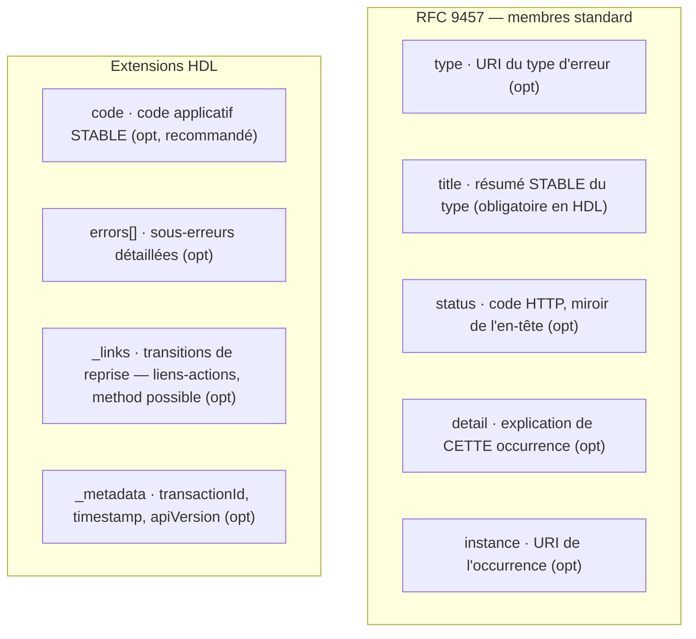
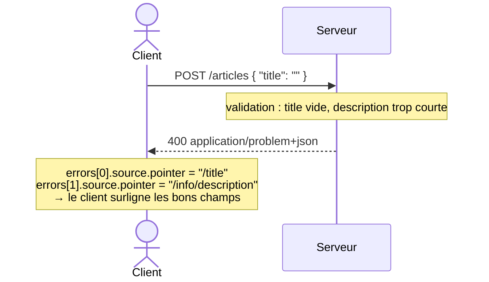

# Erreurs

Format des réponses d'erreur de **Hypermedia Domain Language (HDL)**, un format de représentation fondé sur **HTTP et JSON**. Les erreurs HDL sont des objets JSON servis avec le type de média `application/problem+json` : elles forment un **sur-ensemble du RFC 9457 (*Problem Details for HTTP APIs*)**, dont elles reprennent les membres et qu'elles complètent là où il est lacunaire — erreurs multiples, localisation au champ, code applicatif stable, hypermédia. Le vocabulaire `_links` / `_metadata` est commun aux réponses de succès HDL : un seul modèle, un seul parseur.

---

## Comment lire ce document

Ce document suppose **zéro connaissance préalable** du RFC 9457, du JSON Pointer ou de HAL. Chaque notion est introduite **par le problème concret qu'elle résout**, avec un exemple. Les encadrés **En clair**, **Exemple**, **Piège évité** et **À ne pas confondre** donnent la version rapide ; les **règles normatives** (en gras ou en blockquote) font foi. Les schémas sont au format **Mermaid** (rendu sur GitHub et la plupart des éditeurs Markdown).

---

## Le problème à résoudre

Quand une requête échoue, un `{ "error": "ça n'a pas marché" }` improvisé ne suffit pas. Un client qui reçoit une erreur a **cinq besoins distincts** :

1. **Comprendre** ce qui s'est passé (un humain lit un message).
2. **Brancher** dessus en code (`if c'est un paiement refusé → proposer une autre carte`), sans parser du texte libre.
3. **Localiser** le champ fautif (quel champ du formulaire est invalide ?).
4. **Accéder à la documentation** de cette erreur précise.
5. **Corréler** l'incident avec le support (« voici l'identifiant de ma requête »).

Plutôt que d'inventer un énième format, HDL **étend** le **RFC 9457**, le standard IETF pour décrire une erreur HTTP en JSON. On hérite ainsi de son outillage (frameworks, clients, observabilité qui savent déjà lire `application/problem+json`) et on complète ses lacunes.

> **En clair —** *HDL-erreur = RFC 9457 + quelques extensions.* Rien n'est réinventé ; on ajoute par-dessus le standard.

---

## Relation avec le RFC 9457

**Le RFC 9457 en deux lignes.** C'est un petit objet JSON décrivant une erreur HTTP, servi avec le type de média `application/problem+json`, composé de **cinq membres, tous optionnels** : `type`, `title`, `status`, `detail`, `instance`. Point crucial : le standard **autorise explicitement des membres d'extension** (§3.2) et impose qu'un client **ignore les membres qu'il ne connaît pas**.

Ce point garantit la **compatibilité ascendante** : un consommateur « 9457 pur » lit une erreur HDL sans difficulté, en ignorant les membres d'extension qu'il ne connaît pas.

HDL fait donc trois choses :
- il **conserve** les cinq membres standard avec leur sémantique d'origine ;
- il **sert** ses erreurs en `application/problem+json` ;
- il **ajoute** quatre extensions : `code`, `errors[]`, `_links`, `_metadata`.

| Champ HDL | RFC 9457 | Nature |
|---|---|---|
| `type` | `type` | standard |
| `title` | `title` | standard |
| `status` | `status` | standard |
| `detail` | `detail` | standard |
| `instance` | `instance` | standard |
| `code` | — | **extension HDL** |
| `errors[]` (+ `source`, `code`, `type` par sous-erreur) | — | **extension HDL** |
| `_links` (transitions de reprise ; `method` sur liens-actions) | — | **extension HDL** (HAL) |
| `_metadata` | (sinon membres d'extension à plat) | **extension HDL** |

> **Note de resserrement —** HDL est légèrement plus strict que 9457 sur un point : `title` y est **obligatoire** (9457 le laisse optionnel). C'est le seul champ requis ; tout le reste est optionnel.

---

## Anatomie d'une erreur

Une erreur HDL est un objet dont les membres se répartissent en deux familles : ceux du **standard** et les **extensions HDL**.



**La forme minimale.** Le strict nécessaire, c'est le code HTTP (dans l'en-tête) et un `title`.

**Exemple — erreur métier minimale**

```http
HTTP/1.1 422 Unprocessable Entity
Content-Type: application/problem+json
```
```json
{ "title": "Payment refused." }
```

> **En clair —** on peut s'arrêter là. Tous les autres champs servent à enrichir : brancher (`code`), localiser (`errors[].source`), documenter (`type`), corréler (`_metadata`).

---

## Les membres standard (RFC 9457)

### `type` — quel *genre* d'erreur, et sa documentation

**D'où ça vient.** Pour qu'un client (ou un développeur) sache *de quel type de problème* il s'agit et où lire sa documentation, le RFC 9457 fournit `type` : une **URI** qui identifie la catégorie d'erreur et, idéalement, déréférence vers une page explicative.

**À quoi ça sert.** Identifier le type d'erreur de façon globale et donner un lien de doc. Valeur par défaut si absent : `about:blank` (signifie « pas de type particulier au-delà du statut HTTP »).

```json
{ "type": "https://example.com/docs/errors/payment-refused", "title": "Payment refused." }
```

### `title` — le résumé humain, stable

**D'où ça vient.** Il faut une phrase courte et lisible décrivant le problème. Mais attention : `title` décrit le **type** d'erreur, pas l'occurrence — il doit être **le même pour toutes les occurrences du même `type`**.

**À quoi ça sert.** Donner un libellé humain stable, sur lequel on peut même fonder un affichage. C'est le **seul champ obligatoire** en HDL.

> **À ne pas confondre — `title` vs `detail`.** `title` est **stable** (« Payment refused. » à chaque fois) ; `detail` est **propre à cette occurrence** (« The card ending 4242 was declined by the issuing bank. », qui varie). Le `title` se prête au branchement d'affichage ; le `detail` informe sur le cas précis.

> **Piège évité — ne pas mettre la *reason phrase* HTTP dans `title`.** « Unprocessable Entity » est déjà déductible du `status` (422) : la répéter dans `title` n'apporte rien. `title` doit porter le sens **métier** (« Payment refused. »), pas le libellé HTTP.

### `status` — le code HTTP, en double (déconseillé)

**D'où ça vient.** Le code HTTP est déjà dans la ligne de statut de la réponse. Le membre `status` du corps n'en est qu'une copie — le RFC 9457 le qualifie lui-même d'*advisory only*.

**Position de HDL.** **HDL n'encourage pas `status`.** Le code HTTP de la réponse est la **source de vérité** ; `status` n'a d'utilité que lorsque le document est manipulé **hors contexte HTTP** (journaux, files de messages, stockage), où l'en-tête n'est plus disponible. On ne l'interdit pas (9457 le prévoit), mais on en réduit l'usage : un client HTTP le connaît déjà, beaucoup de frameworks l'ajoutent automatiquement, et il peut diverger.

> **Piège évité — un `status` qui ment.** S'il est présent, `status` **doit** être identique au code HTTP. Un `status: 200` dans le corps d'une réponse `4xx` désoriente clients et proxies. (Une donnée dupliquée doit avoir une autorité unique et ne jamais diverger.)

### `detail` — l'explication de cette occurrence

**D'où ça vient.** Au-delà du type, on veut souvent expliquer *ce cas précis* : pourquoi *cette* requête a échoué.

**À quoi ça sert.** Donner une explication spécifique à l'occurrence. Contrairement à `title`, il varie d'un appel à l'autre.

> **À ne pas confondre — public visé.** Par défaut, `title` et `detail` sont **orientés développeur / journalisation**, pas affichage utilisateur final brut. Si tu les exposes à l'utilisateur, prévois la **localisation**, et garde-toi de fuiter de l'interne (voir *Sécurité*).

### `instance` — l'URI de l'occurrence

**D'où ça vient.** Pour corréler l'erreur à *ce qui l'a provoquée*, le RFC 9457 fournit `instance` : une URI identifiant l'occurrence. Le standard laisse le choix ouvert — ce peut être l'URI de la **requête/ressource concernée**, ou l'URI d'un **incident** dédié (p. ex. `/problems/{id}`, que le support peut consulter).

**Position de HDL.** **HDL recommande d'utiliser l'URI de la requête fautive** comme valeur de `instance` (p. ex. `"/articles/42:buy"`). C'est un choix de profil — pas la seule lecture possible du RFC ; une API qui expose des incidents déréférençables reste libre d'y mettre leur URI.

> **À ne pas confondre — `instance` vs `transactionId`.** `instance` est une **URI** (la requête fautive) ; `transactionId` (dans `_metadata`) est un **identifiant opaque** d'occurrence, pour le traçage et le support. L'un localise, l'autre trace.

---

## Les extensions HDL

### `code` — le code applicatif stable (le crochet machine)

**D'où ça vient.** Un client doit pouvoir **brancher** sur une erreur sans parser une phrase ni déréférencer une URI. Le `type` (URI) est fait pour les humains et la doc ; il faut un identifiant **court, stable, machine-actionnable**.

**À quoi ça sert.** Fournir un code applicatif stable, en `SCREAMING_SNAKE_CASE`, identique pour toutes les occurrences du même problème. C'est ce sur quoi le code client teste : `if (err.code === "PAYMENT_REFUSED") …`.

```json
{ "title": "Payment refused.", "code": "PAYMENT_REFUSED" }
```

> **À ne pas confondre — `code` (stable) vs identifiant d'occurrence (`_metadata.transactionId`).** Ce sont deux besoins **opposés** :
> - `code` est **stable** : `PAYMENT_REFUSED` à chaque fois → on peut brancher dessus.
> - l'identifiant d'occurrence est **unique à chaque appel** (un GUID), destiné au **support / traçage** → il va dans `_metadata.transactionId`, **jamais** dans `code`.
>
> Un `code` qui serait parfois un GUID aléatoire deviendrait inutilisable pour le branchement. **Un GUID n'est jamais un `code`.**

> **À ne pas confondre — `code` vs `type`.** Les deux disent « quel genre d'erreur ». `type` est une **URI** (humains, documentation, déréférençable) ; `code` est un **jeton court** (machines, sans appel réseau). On utilise les deux : `type` pour documenter, `code` pour brancher.

### `errors[]` — les erreurs multiples (l'apport principal)

**D'où ça vient.** Le plus gros trou du RFC 9457 : il n'a **aucune** structure pour signaler **plusieurs problèmes à la fois** — or c'est le cas le plus courant (valider un formulaire renvoie souvent plusieurs champs en faute). `errors[]` comble ce manque.

**À quoi ça sert.** Lister des sous-erreurs détaillées, chacune optionnellement localisée et documentée.

**Exemple — le cycle d'une erreur de validation**



Chaque entrée de `errors[]` :

#### `errors[].detail` (obligatoire)

Le message spécifique à cette sous-erreur. C'est l'équivalent, au niveau sous-erreur, du `detail` global. Exemple : `"Title is required."`.

#### `errors[].code` (optionnel)

Un code stable propre à cette sous-erreur (même nature que le `code` global). Exemple : `"TITLE_REQUIRED"`.

#### `errors[].source` (optionnel) — localiser la faute

**D'où ça vient.** « La requête est invalide » ne suffit pas : le client veut savoir **quel champ**. `source` désigne l'emplacement exact du problème.

**À quoi ça sert.** Pointer l'origine. Exactement **un** des trois membres suivants :

- **`pointer`** — un **JSON Pointer (RFC 6901)** vers un champ du **corps de la requête** : un chemin où `/` sépare les niveaux, comme `/title` ou `/info/description`. (Ce n'est **pas** un chemin d'URL.)
- **`parameter`** — le nom d'un **paramètre de query** fautif, comme `sort`.
- **`header`** — le nom d'un **en-tête de requête** fautif, comme `Idempotency-Key`.

> **Règle —** `pointer`, `parameter` et `header` sont **mutuellement exclusifs** : une sous-erreur en porte **au plus un**.

> **À ne pas confondre — base du `pointer`.** Le pointer vise le **corps tel qu'envoyé** (`/title`, `/info/description`). HDL n'a **pas** d'enveloppe `data/attributes` : n'écris pas `/data/attributes/title`.

**Exemple — paramètre de query invalide** (`GET /articles?sort=…`)
```json
{
  "title": "Invalid query.",
  "errors": [
    { "detail": "Invalid sort parameter value.", "source": { "parameter": "sort" } }
  ]
}
```

**Exemple — en-tête manquant**
```json
{
  "title": "Missing header.",
  "errors": [
    { "detail": "Report-Id header is required to download the report.", "source": { "header": "Report-Id" } }
  ]
}
```

#### `errors[].type` (optionnel) — doc de la sous-erreur

Une **URI** documentant ce type de sous-erreur (même rôle que le `type` global, mais propre à la sous-erreur).

```json
{
  "code": "TITLE_TOO_LONG",
  "detail": "Title is too long.",
  "source": { "pointer": "/title" },
  "type": "https://example.com/docs/errors/title-too-long"
}
```

### `_links` — les transitions de reprise (rôle applicatif)

**Idée générale.** Une erreur ne dit pas seulement *ce qui a échoué* ; elle peut indiquer *ce que le client peut faire ensuite*. C'est le rôle de `_links` dans une réponse d'erreur HDL : exposer les **transitions de reprise** que le serveur propose après l'échec — retenter l'opération, corriger une ressource liée, changer de moyen de paiement, ouvrir un ticket support, consulter une ressource de reprise. Ces suites sont **dictées par le métier**, pas par le format.

> **En clair — trois rôles distincts.** `type` dit *quel genre d'erreur* c'est (et où lire la doc) ; `instance` dit *quelle requête* a échoué ; `_links` dit *quoi faire maintenant*. `_links` ne reprend donc ni `type`, ni `instance`.

**Le même mécanisme que les succès.** HDL est HAL-based : ses réponses de succès portent déjà des liens dans `_links` — certains de simples ressources (`self`), d'autres des **liens-actions** (`buy`, `purchase`…). Sur une erreur, c'est **le même objet et le même parseur** ; rien de nouveau à apprendre côté client.

**Liens-actions et `method`.** Un lien qui représente une **opération** (et non la lecture d'une ressource) porte explicitement sa méthode HTTP — par exemple `"change-payment-method": { "href": "/orders/42:set-payment-method", "method": "POST" }`. Un lien **sans** `method` est, par défaut, une ressource à lire en `GET` (p. ex. `"support": { "href": "https://example.com/support" }`).

> **À ne pas confondre — une URL ne décrit pas une action.** `{ "href": "/orders/42:…" }` seul est ambigu : faut-il le **lire** (`GET`) ou l'**exécuter** (`POST`) ? Dès qu'un lien représente une opération **non-`GET`**, la méthode est explicite.

> **Note — `method` est une extension HDL.** Un lien HAL standard ne porte que `href`, `templated`, `type`, `name`… pas `method`. HDL l'ajoute (comme le font JSON Hyper-Schema ou HAL-FORMS) pour qu'un lien-action soit **autoporteur** — extension assumée, identique côté succès et côté erreur.

**Le vocabulaire des relations est applicatif, jamais imposé.** HDL fournit le **mécanisme** (un lien-action dans `_links`) ; le **choix des relations** appartient à l'application. `retry`, `fix`, `change-payment-method`, `support`, `help`… sont des **exemples courants**, pas une liste fermée ni un workflow obligatoire. **Aucune relation n'est normative** sur les erreurs.

> **Garde-fou — `retry` et l'idempotence.** Une relation `retry` signifie que *le serveur autorise une nouvelle tentative de l'opération indiquée* — **pas** « rejoue aveuglément la requête ». Pour une commande à effet (paiement, confirmation), retenter veut dire la **réémettre avec la même `Idempotency-Key`** (voir la spécification d'idempotence), faute de quoi on risque le double effet. Cette sémantique est **métier**, pas une règle de format.

### `_metadata` — métadonnées d'occurrence

**D'où ça vient.** Pour le support et l'observabilité, on joint des informations propres à l'appel : identifiant de transaction, horodatage, version d'API.

**À quoi ça sert.** Les regrouper dans un **objet** extensible dont le contenu dépend du serveur.

**Pourquoi un objet `_metadata`, et non des membres à plat ?** Le RFC 9457 mettrait ces champs à la racine. HDL les regroupe pour deux raisons : (1) `_metadata` est **l'enveloppe d'observabilité commune aux réponses de succès HDL** — mêmes clés, même parseur, succès et erreurs confondus ; (2) cela **isole** ces champs serveur des membres standard de 9457, évitant toute collision si le standard s'enrichit. Le préfixe `_`, comme pour `_links`, signale un membre **structurel** HDL (réservé), distinct des données métier.

```json
{
  "_metadata": {
    "transactionId": "550e8400-e29b-41d4-a716-446655440001",
    "timestamp": "2024-05-25T14:35:00Z",
    "apiVersion": "1.2.3"
  }
}
```

> **En clair —** `_metadata.transactionId` est **l'identifiant d'occurrence** (le GUID que l'on donne au support). C'est là qu'il vit — pas dans `code`.

---

## Quels champs selon le type d'erreur ?

| Situation | Champs typiques |
|---|---|
| **Validation (400)** | `title` + `code` + `errors[]` avec un `source.pointer` par champ fautif |
| **Règle métier (422)** | `title` + `detail` + `code` (p. ex. `PAYMENT_REFUSED`) ; `errors[]` si plusieurs raisons |
| **Auth (401 / 403)** | minimal : `title` + `code`, `detail` **générique** (ne pas révéler *pourquoi*, voir Sécurité) |
| **En-tête requis (428)** | `code` stable + `errors[].source.header` (l'en-tête manquant) |
| **Conflit (409)** | `code` stable + `detail` |

---

## Sécurité

> **Piège évité — fuite d'informations.** `detail` et `source` sont orientés développeur, mais traversent le réseau. **Ne jamais** y exposer d'interne : traces de pile, requêtes SQL, identifiants internes, raisons de refus sensibles. Sur **401 / 403** en particulier, garder un `detail` **générique** : révéler *pourquoi* l'accès est refusé renseigne un attaquant. La localisation, si `title`/`detail` sont affichés à l'utilisateur, se fait côté présentation.

---

## Exemples complets

### 400 — Bad Request (validation, plusieurs champs)

```http
POST /articles
Content-Type: application/json

{ "title": "", "info": { "description": "Too short" } }
```
```json
{
  "type": "https://example.com/docs/errors/invalid-command",
  "title": "Invalid command.",
  "status": 400,
  "detail": "The command to create the article is invalid.",
  "instance": "/articles",
  "code": "INVALID_COMMAND",
  "errors": [
    {
      "code": "TITLE_REQUIRED",
      "detail": "Title is required.",
      "source": { "pointer": "/title" },
      "type": "https://example.com/docs/errors/title-required"
    },
    {
      "code": "DESCRIPTION_TOO_SHORT",
      "detail": "Description must be at least 10 characters long.",
      "source": { "pointer": "/info/description" }
    }
  ],
  "_metadata": {
    "transactionId": "550e8400-e29b-41d4-a716-446655440002",
    "timestamp": "2024-05-25T14:40:00Z"
  }
}
```

### 403 — Forbidden (détail générique)

```http
GET /reports/42:download
Authorization: Bearer <token valide>
```
```json
{
  "type": "https://example.com/docs/errors/report-download-denied",
  "title": "Report download denied.",
  "status": 403,
  "detail": "You are not allowed to download this report.",
  "instance": "/reports/42:download",
  "code": "REPORT_DOWNLOAD_DENIED",
  "_metadata": { "transactionId": "c9a5f1e2-4f9d-45ab-b5e3-2b9f72b8f1d7", "timestamp": "2024-05-25T15:00:00Z" }
}
```

### 422 — Unprocessable Entity (règle métier)

```http
POST /articles/42:buy
Content-Type: application/json

{ "paymentMethod": "invalid-method" }
```
```json
{
  "type": "https://example.com/docs/errors/payment-refused",
  "title": "Payment refused.",
  "status": 422,
  "detail": "The card was refused by the issuing bank.",
  "instance": "/articles/42:buy",
  "code": "PAYMENT_REFUSED",
  "_links": {
    "change-payment-method": { "href": "/orders/42:set-payment-method", "method": "POST" },
    "support": { "href": "https://example.com/support" }
  },
  "_metadata": { "transactionId": "c01a4e2b-7f3d-4d3b-9101-f5a1e3b2e2b1", "timestamp": "2024-05-25T14:35:00Z" }
}
```

---

## HDL et DORIAX ensemble

**DORIAX** est un profil d'API REST orienté domaine — un ensemble de conventions : ressources, actions nommées (`/ressource/{id}:verbe`), idempotence, etc. Il **impose** HDL comme format de représentation de ses réponses ; la dépendance ne va que dans ce sens, HDL ignorant tout de DORIAX. Cette section illustre, **sans introduire aucune règle HDL nouvelle**, comment DORIAX consomme le format.

- **Les codes d'erreur stables de DORIAX *sont* des `code` HDL.** Les codes du châssis d'idempotence (`IDEMPOTENCY_KEY_REQUIRED`, `IDEMPOTENCY_KEY_REUSED`, `IDEMPOTENCY_STORE_UNAVAILABLE`…) sont exactement des codes applicatifs stables sur lesquels le client branche — l'usage type du `code` HDL.
- **`source.header` localise l'en-tête fautif.** Un `Idempotency-Key` manquant se signale proprement via `source.header`.

**Démonstration — un `428` d'idempotence DORIAX, rendu en HDL**

```http
POST /articles/42:buy
Content-Type: application/json
```
```json
{
  "title": "Idempotency key required.",
  "status": 428,
  "detail": "This command requires an Idempotency-Key header.",
  "code": "IDEMPOTENCY_KEY_REQUIRED",
  "instance": "/articles/42:buy",
  "errors": [
    { "detail": "Header is missing.", "source": { "header": "Idempotency-Key" } }
  ]
}
```

> **En clair —** rien ci-dessus n'est une *règle* HDL : c'est DORIAX qui *utilise* le format. HDL reste lisible et implémentable sans connaître DORIAX ; les deux se complètent.

---

## Conformité RFC 9457 (récapitulatif)

- [x] Erreurs servies en `application/problem+json`.
- [x] Membres `type` / `title` / `status` / `detail` / `instance` avec leur **sémantique standard** (`title` stable par type, `detail` par occurrence).
- [x] `status` **déconseillé** (*advisory only*) : l'en-tête HTTP fait foi ; réservé à l'usage hors contexte HTTP.
- [x] `instance` = URI de la **requête fautive** (recommandation de profil ; 9457 autorise aussi une URI d'incident).
- [x] Extensions HDL (`code`, `errors[]`, `_links`, `_metadata`) ajoutées comme **membres d'extension** — sûres pour un client « 9457 pur », qui les **ignore**.
- [x] `code` **toujours stable** ; l'identifiant d'occurrence vit dans `_metadata.transactionId`.
- [x] `errors[].source` : **au plus un** parmi `pointer` (JSON Pointer du corps) / `parameter` / `header`.
- [x] `_links` (transitions de reprise) et la propriété `method` d'un lien sont des **extensions HDL** (hors 9457), ignorées par un client « 9457 pur » ; leurs relations sont **applicatives**, non normatives. La documentation reste portée par `type`, la requête fautive par `instance`.

---

## Tableau récapitulatif des champs

| Champ | Niveau | Obligation | Type | Rôle |
|---|---|---|---|---|
| `type` | racine | optionnel | URI | type d'erreur + doc |
| `title` | racine | **obligatoire** | string | résumé humain **stable** du type |
| `status` | racine | optionnel (**déconseillé**) | number | copie du code HTTP — usage hors contexte HTTP |
| `detail` | racine | optionnel | string | explication de l'occurrence |
| `instance` | racine | optionnel | URI | URI de la **requête fautive** (recommandé) |
| `code` | racine | optionnel (recommandé) | string | **code applicatif stable** (branchement) |
| `errors[]` | racine | optionnel | array | sous-erreurs détaillées |
| `errors[].detail` | sous-erreur | **obligatoire** | string | message de la sous-erreur |
| `errors[].code` | sous-erreur | optionnel | string | code stable de la sous-erreur |
| `errors[].source` | sous-erreur | optionnel | object | `pointer` \| `parameter` \| `header` (un seul) |
| `errors[].type` | sous-erreur | optionnel | URI | doc de la sous-erreur |
| `_links` | racine | optionnel | object | **transitions de reprise** : liens-actions HAL ; relations **applicatives**, non imposées |
| `_links.<rel>.method` | lien | optionnel | string | méthode HTTP d'un lien-**action** (extension HDL ; explicite si non-`GET`) |
| `_metadata` | racine | optionnel | object | `transactionId`, `timestamp`, `apiVersion`… |
